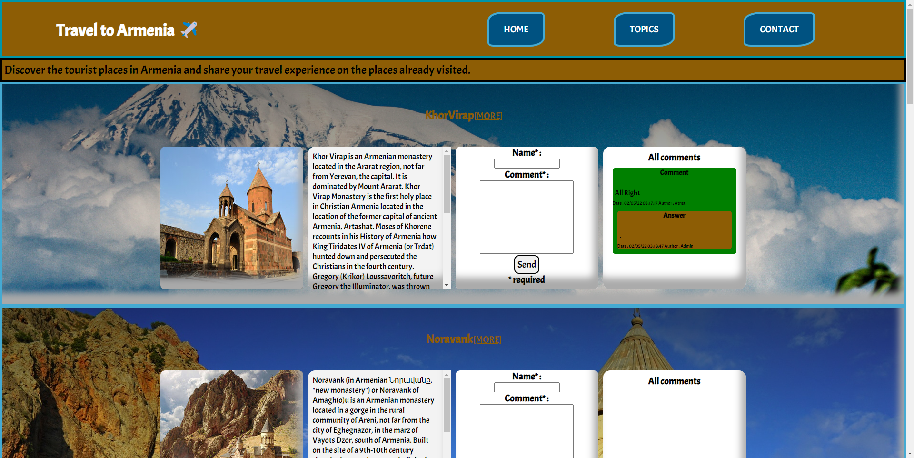
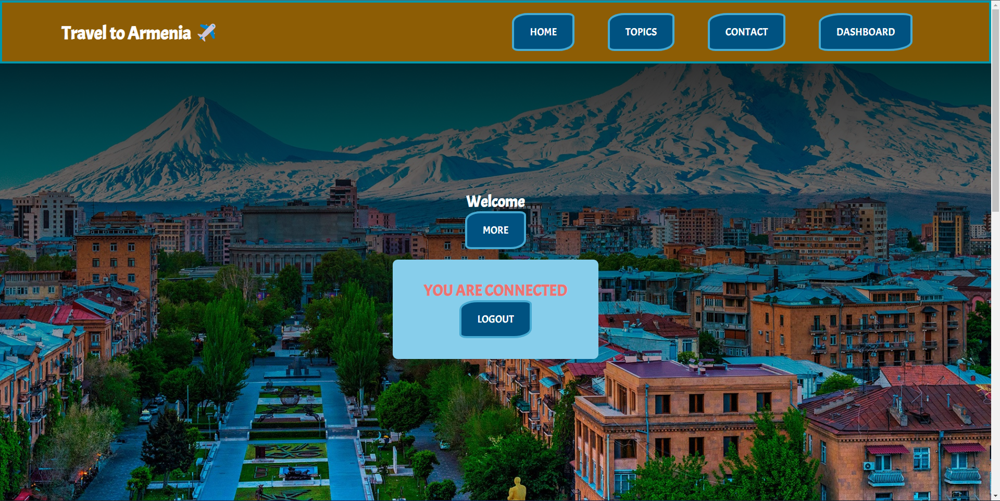
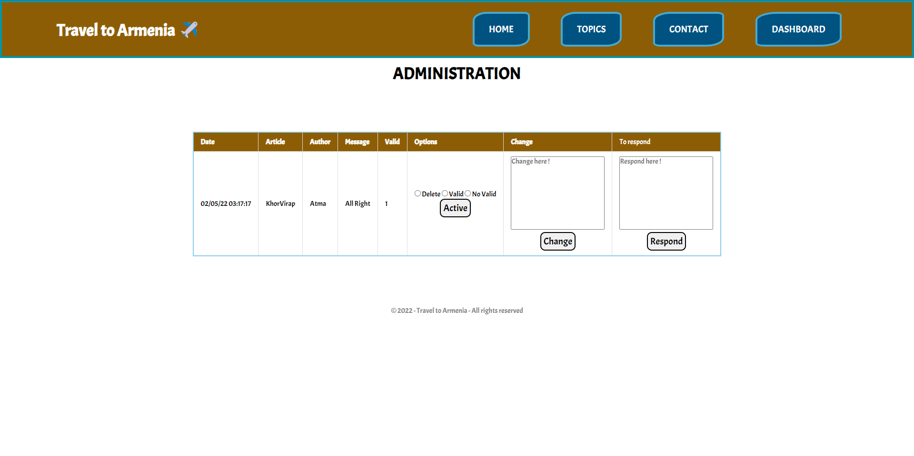

# WEB PROGRAMMING

## Description
This repository is dedicated to UE "web programming 2" and will contain the progressive evolution of the pratical work.

## Presentation
#### Figure 1 : Home page
.png)
.png)

#### Figure 2 : Topics page

#### Figure 3 : Connected page

#### Figure 4 : Administration page

## Road Map (in french)

- [x] Utilisation d'objet
- [x] Utilisation de Flex
- [x] Utilisation de Grid
- [x] Travail sur l'accessibilité
- [x] Utilisation de favicon
- [x] Responsive design
- [x] Compatible PC, tablette, smartphone
- [x] Gestion d'erreur
- [x] Gestion de la soumission d'un formulaire
- [x] Utilisation de session
- [x] Mise en place du modèle MVC
- [x] Connexion en tant qu'admin
- [x] Ajout de commentaire
- [x] Modification de commentaire
- [x] Suppression de commentaire
- [x] Répondre à un commentaire
- [x] Modifier la réponse 
- [x] Valider/Devalider un commentaire
- [x] Utilisation de javascript
- [x] Table BDD users, comments, answer

Future amélioration :
- [ ] Page contact 
- [ ] Système de like/dislike des images
- [ ] Possibilité d'inscription
- [ ] Amélioration du design des articles complets

BONNE DECOUVERTE DU SITE TRAVEL TO ARMENIA !!!

## Progression

* Pratical work 7 -> Date : 30/03/2022 : Database connection succeed
* Pratical work 6 -> Date : 23/03/2022 : Correction of errors database connection
* Pratical work 5 -> Date : 16/03/2022 : Correction of errors and responsive design
* Partical work 4 -> Date : 09/03/2022 : Database connection
* Pratical work 3 -> Date : 03/02/2022 : Add connection bar
* Pratical work 2 -> Date : 02/23/2022 : Design of home
* Pratical work 1 -> Date : 02/09/2022 : First page structure 

## My page

Identifiant de connexion en admin : 
Email : admin@unistra.fr
Mdp : admin

https://osr-etudiant.unistra.fr/~zarikian/web-programming-2/